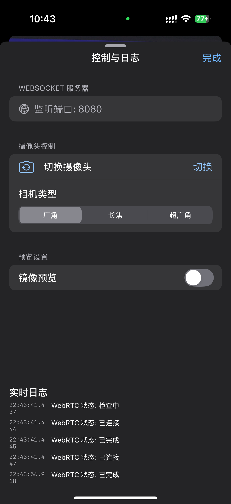

# HuanCapture

HuanCapture 是一个为 macOS/iOS 设计的 Swift 视频捕获和 WebRTC 集成库，具有高度灵活性和可扩展性，特别适合与 SwiftUI 搭配使用。它采用基于协议的视频源提供者 (`VideoFrameProvider`) 架构，允许开发者轻松集成摄像头、应用内屏幕捕捉或其他自定义视频源。

## 演示截图

<div align="center">
  
  
  <br><br>
  
  
<br><br>

</div>

## 功能特点

- **灵活的视频源**:
    - **摄像头**: 通过 `CameraFrameProvider` 支持前后摄像头切换及后置多摄像头类型切换（广角、长焦、超广角）。
    - **应用内屏幕捕捉**: 通过 `ExternalFrameProvider` 结合 ReplayKit 的 `RPScreenRecorder` 实现应用内屏幕画面推流。
    - **自定义视频源**: 可通过实现 `VideoFrameProvider` 协议接入任何视频数据源。
- **WebRTC 集成**: 简化 WebRTC 连接和媒体流处理。
- **SwiftUI 友好**: 提供预览视图，易于集成到 SwiftUI 应用中。
- **多种信令模式**:
    - **WebSocket**: 内置 WebSocket 服务器，方便快速搭建原型。
    - **EsMessenger**: 集成 `es-cast-client-ios` 库，通过其消息通道进行信令交换。
    - **Custom**: 完全自定义信令处理。
- **状态监控**: 提供 WebRTC 连接状态和 WebSocket 服务器状态的实时监控。
- **可配置性**: 支持通过 `HuanCaptureConfig` 自定义 WebRTC 参数（如比特率、帧率）和日志级别。
- **跨平台**: 针对 iOS 和 macOS 平台优化。

## 安装要求

- iOS 14.0+ / macOS 11.0+
- Swift 5.5+ (建议)
- Xcode 13.0+
- **(可选)** 如果使用 `EsMessenger` 模式，需要在您的项目中集成 `es-cast-client-ios` 库。

## 核心概念: VideoFrameProvider

`HuanCaptureManager` 的核心设计围绕 `VideoFrameProvider` 协议。您在初始化 `HuanCaptureManager` 时，需要提供一个实现了此协议的对象。这决定了视频数据的来源。

HuanCapture 提供了两个内置的 Provider：

1.  **`CameraFrameProvider`**: 用于从设备的摄像头捕获视频。
2.  **`ExternalFrameProvider`**: 用于接收外部生成的 `CVPixelBuffer` 数据，非常适合应用内屏幕捕捉或其他自定义渲染的场景。

```swift
// VideoFrameProvider.swift (协议定义)
public protocol VideoFrameProviderDelegate: AnyObject {
    func videoFrameProvider(_ provider: VideoFrameProvider, didCapture videoFrame: RTCVideoFrame)
    // ... 其他回调 ...
}

public protocol VideoFrameProvider: AnyObject {
    var delegate: VideoFrameProviderDelegate? { get set }
    func startProviding()
    func stopProviding()
    // ...
}

public protocol CameraControlProvider: VideoFrameProvider {
    // ... 摄像头特有控制接口 ...
}
```

## 快速开始

### 1. 选择并创建 VideoFrameProvider

**a) 使用摄像头 (`CameraFrameProvider`)**

```swift
import HuanCapture

// 创建 CameraFrameProvider
let cameraProvider = CameraFrameProvider.create(
    isLoggingEnabled: true,
    initialPosition: .back, // .front 或 .back
    initialType: .wideAngle   // 针对后置摄像头
)
```

**b) 使用应用内屏幕捕捉或其他外部源 (`ExternalFrameProvider`)**

```swift
import HuanCapture
import ReplayKit // 如果用于屏幕捕捉

// 创建 ExternalFrameProvider
let externalFrameProvider = ExternalFrameProvider.create(isLoggingEnabled: true)

// 对于屏幕捕捉，您还需要配置 RPScreenRecorder (详见后续示例)
```

### 2. 配置并初始化 HuanCaptureManager

```swift
import HuanCapture
#if canImport(es_cast_client_ios)
import es_cast_client_ios // 如果使用 EsMessenger 模式
#endif

// --- 选择配置 ---
// 示例: 使用内置 WebSocket 信令服务器
let huanConfig = HuanCaptureConfig(
    isLoggingEnabled: true,
    signalingModeInput: .webSocket,
    webSocketPort: 8080
    // maxBitrateBps, minBitrateBps, maxFramerateFps 等参数可按需配置
)

// --- 初始化 HuanCaptureManager ---
// 假设我们使用 cameraProvider
let captureManager = HuanCaptureManager(
    frameProvider: cameraProvider, // 传入您选择的 provider
    config: huanConfig
)

// 如果使用 externalFrameProvider:
// let captureManagerForScreen = HuanCaptureManager(frameProvider: externalFrameProvider, config: huanConfig)

// --- (可选) EsMessenger特定设备获取 ---
#if canImport(es_cast_client_ios)
func getMyTargetEsDevice() -> EsDevice? {
    return EsMessenger.shared.connectedDevice // 示例
}
// 如果使用 .esMessenger 模式, 确保在 huanConfig 中正确配置
// let esDevice = getMyTargetEsDevice()! // 确保设备存在
// let esConfig = HuanCaptureConfig(signalingModeInput: .esMessenger(esDevice))
// let captureManagerWithEs = HuanCaptureManager(frameProvider: cameraProvider, config: esConfig)
#endif
```

### 3. 在SwiftUI中使用预览视图

`HuanCaptureManager` 提供了一个 `previewView` (UIView)，您可以将其包装起来在 SwiftUI 中显示。

```swift
import SwiftUI
import HuanCapture

struct ContentView: View {
    @StateObject private var captureManager: HuanCaptureManager
    private let screenRecorder = RPScreenRecorder.shared() // 仅用于屏幕捕捉示例
    private let externalFrameProvider: ExternalFrameProvider // 仅用于屏幕捕捉示例

    init() {
        // 示例：应用内屏幕捕捉设置
        let efProvider = ExternalFrameProvider.create(isLoggingEnabled: true)
        self.externalFrameProvider = efProvider
        let config = HuanCaptureConfig(isLoggingEnabled: true, signalingModeInput: .webSocket)
        _captureManager = StateObject(wrappedValue: HuanCaptureManager(frameProvider: efProvider, config: config))
    }
    
    var body: some View {
        VStack {
            Text("视频预览 / 屏幕内容")
                .font(.headline)
            
            // HuanCaptureManager 的预览视图 (对于摄像头模式会显示摄像头内容)
            // 对于 ExternalFrameProvider，它会显示被推送到 WebRTC 的帧，但内容本身由外部提供
            CapturePreviewRepresentable(captureView: captureManager.previewView)
                .aspectRatio(CGSize(width: 16, height: 9), contentMode: .fit)
                .frame(height: 250)
                .background(Color.black)
                .cornerRadius(12)
                .clipped()
            
            // 控制按钮
            HStack(spacing: 15) {
                Button("开始推流") {
                    // 如果是屏幕捕捉，确保屏幕捕捉已启动
                    captureManager.startStreaming()
                }
                .buttonStyle(.borderedProminent)
                
                Button("停止推流") {
                    captureManager.stopStreaming()
                    // 如果是屏幕捕捉，也应停止屏幕捕捉
                }
                .buttonStyle(.bordered)
                .tint(.red)
            }
            .padding(.top)

            // (如果使用 CameraFrameProvider)
            if captureManager.isCameraProvider { // 假设有此辅助属性
                HStack(spacing: 15) {
                    Button("切换镜头") {
                        captureManager.switchCamera()
                    }
                    Button("换后置类型") {
                        captureManager.switchBackCameraType()
                    }
                }
                .padding(.top, 5)
            }
        }
        .padding()
    }
}

// 用于将UIView包装为SwiftUI视图的Helper
struct CapturePreviewRepresentable: UIViewRepresentable {
    let captureView: UIView
    
    func makeUIView(context: Context) -> UIView { return captureView }
    func updateUIView(_ uiView: UIView, context: Context) {}
}

// 辅助扩展 (建议添加到 HuanCaptureManager)
extension HuanCaptureManager {
    var isCameraProvider: Bool {
        return self.value(forKey: "frameProvider") is CameraControlProvider // 使用 KVC 访问私有属性仅为示例，实际应提供公共接口
        // 或者更安全的方式是在 HuanCaptureManager 中添加一个公共属性来判断 frameProvider 的类型
    }
}
```

### 4. 应用内屏幕捕捉示例 (`ExternalFrameProvider` + `RPScreenRecorder`)

```swift
// 在您的 SwiftUI View 中 (例如 ContentView)

// @StateObject private var captureManager: HuanCaptureManager (已在上面初始化)
// private let externalFrameProvider: ExternalFrameProvider (已在上面初始化)
// private let screenRecorder = RPScreenRecorder.shared()
@State private var isScreenRecording = false

// ...

func toggleScreenCaptureAndStreaming() {
    if isScreenRecording {
        // 停止屏幕捕捉
        screenRecorder.stopCapture { error in
            self.isScreenRecording = false
            if let error = error { print("停止屏幕捕捉失败: \(error.localizedDescription)") }
        }
        // 停止 WebRTC 推流
        if !captureManager.connectionState.isIdleOrDisconnected { // 假设有此辅助属性
            captureManager.stopStreaming()
        }
    } else {
        // 开始屏幕捕捉
        guard screenRecorder.isAvailable else {
            print("屏幕录制不可用")
            return
        }
        screenRecorder.startCapture(handler: { (sampleBuffer, bufferType, error) in
            guard error == nil else {
                // 处理错误，可能需要停止
                print("屏幕捕捉错误: \(error!.localizedDescription)")
                self.isScreenRecording = false // 确保状态更新
                self.screenRecorder.stopCapture() // 尝试停止
                if !self.captureManager.connectionState.isIdleOrDisconnected {
                     self.captureManager.stopStreaming()
                }
                return
            }

            if bufferType == .video, let pixelBuffer = CMSampleBufferGetImageBuffer(sampleBuffer) {
                let timestampNs = CMTimeGetSeconds(CMSampleBufferGetPresentationTimeStamp(sampleBuffer)) * 1_000_000_000
                // 将帧数据喂给 ExternalFrameProvider
                self.externalFrameProvider.consumePixelBuffer(pixelBuffer, rotation: ._0, timestampNs: Int64(timestampNs))
            }
        }) { (error) in
            if let error = error {
                print("启动屏幕捕捉失败: \(error.localizedDescription)")
                self.isScreenRecording = false
            } else {
                print("屏幕捕捉已成功启动。")
                self.isScreenRecording = true
                // 屏幕捕捉启动后，再启动 WebRTC 推流
                if self.captureManager.connectionState.isIdleOrDisconnected {
                    self.captureManager.startStreaming()
                }
            }
        }
    }
}

// ... 在 Button 的 action 中调用 toggleScreenCaptureAndStreaming() ...

// 辅助扩展 (RTCIceConnectionState.isIdleOrDisconnected 需要您自行添加或从Demo复制)
// extension RTCIceConnectionState {
//     var isIdleOrDisconnected: Bool { /* ... */ }
// }
```

### 5. 监听状态变化

与之前版本类似，您可以订阅 `HuanCaptureManager` 的 `@Published` 属性来更新 UI。

```swift
// 在您的 SwiftUI View 中
// .onReceive(captureManager.$connectionState) { newState in /* ... */ }
// .onReceive(captureManager.$webSocketStatus) { newState in /* ... */ }
// .onReceive(captureManager.$captureError) { error in /* ... */ }

// 如果使用 CameraFrameProvider，还可以监听摄像头状态：
// .onReceive(captureManager.$currentCameraPosition) { position in /* ... */ }
// .onReceive(captureManager.$currentCameraType) { type in /* ... */ }
// .onReceive(captureManager.$availableBackCameraTypes) { types in /* ... */ }
// .onReceive(captureManager.$isPreviewMirrored) { mirrored in /* ... */ }
```

### 6. 摄像头控制 (`CameraFrameProvider` 特有)

当使用 `CameraFrameProvider` 时，以下 API 可用：

```swift
// 切换前后摄像头
captureManager.switchCamera()

// 循环切换后置摄像头类型
captureManager.switchBackCameraType()

// 切换到指定的后置摄像头类型
captureManager.switchToBackCameraType(.telephoto)

// 设置预览镜像 (通常用于前置摄像头)
captureManager.setPreviewMirrored(true)

// 更新设备方向 (用于正确计算视频旋转)
captureManager.deviceOrientation = UIDevice.current.orientation
```

### 7. WebRTC集成与信令处理

这部分的逻辑与之前版本基本一致，取决于您在 `HuanCaptureConfig` 中选择的 `signalingMode`（`.webSocket`, `.esMessenger`, 或 `.custom`）。请参考之前 README 版本中关于这三种模式的详细说明。

**A) WebSocket 模式 (`.webSocket`)**

- `HuanCaptureManager` 自动启动内置 WebSocket 服务器。
- 您需要一个连接到此服务器的 WebRTC 客户端。
- 信令（Offer SDP, ICE Candidate）由 `HuanCaptureManager` 自动通过 WebSocket 发送。

**B) EsMessenger 模式 (`.esMessenger`)**

- 确保已集成 `es-cast-client-ios`。
- 自行处理 `EsMessenger` 的初始化、连接和事件监听。
- 通过 `captureManager.handleEsEvent(event)` 将接收到的相关事件传递给 `HuanCaptureManager`。
- `HuanCaptureManager` 会自动通过 `EsMessenger` 发送信令。
- 支持通过 `EsEvent` 进行远程控制（推流启停、摄像头切换等）。

**C) 自定义模式 (`.custom`)**

- 完全自行处理信令交换。
- 订阅 `captureManager.$localSDP` 获取 Offer SDP。
- 订阅 `captureManager.iceCandidateSubject` 获取 ICE Candidate。
- 通过 `captureManager.setRemoteDescription()` 设置 Answer SDP。
- 通过 `captureManager.addICECandidate()` 添加远端 ICE Candidate。

## HuanCapture WebRTC Viewer 部署指南 (适用于 WebSocket 模式)

此部分与之前版本相同，用于在 WebSocket 模式下设置 Web 观看端。请参考 `Play` 目录中的文件和说明。

(保持原有部署指南内容不变)
...

## 注意事项

1.  确保在`Info.plist`中添加相关权限描述：
    *   摄像头模式: `NSCameraUsageDescription`, `NSMicrophoneUsageDescription`。
    *   应用内屏幕捕捉: 虽然 ReplayKit 应用内捕捉通常不需要显式权限请求（用户通过系统UI授权），但如果同时使用麦克风，则需要 `NSMicrophoneUsageDescription`。
2.  WebRTC 依赖网络连接。
3.  公网访问可能需要 STUN/TURN 服务器。
4.  生产环境建议使用安全信令通道 (WSS, HTTPS)。
5.  **EsMessenger 模式依赖:** 确保正确集成 `es-cast-client-ios`。

