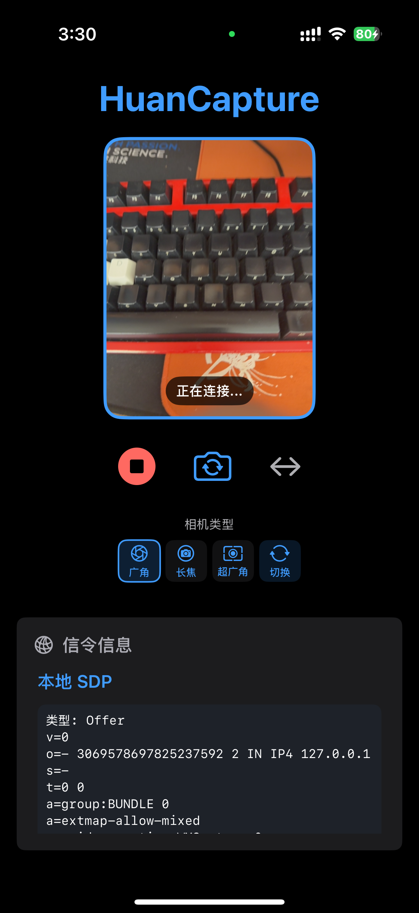

# HuanCapture

HuanCapture是一个为macOS/iOS设计的Swift视频捕获和WebRTC集成库，特别适合与SwiftUI搭配使用。它提供了简单的API来捕获和流式传输高质量视频，并**支持多种信令模式**。

## 演示截图

<div align="center">
  
  
  <br><br>
  
  
</div>

## 功能特点

- 简单易用的视频捕获和WebRTC集成
- 完全支持SwiftUI架构
- 提供前后摄像头切换功能
- **支持后置摄像头类型切换**（广角、长焦、超广角）
- 实时视频预览
- **支持多种信令模式**：
    - **WebSocket**: 内置 WebSocket 服务器，方便快速搭建原型。
    - **EsMessenger**: 集成 `es-cast-client-ios` 库，通过其消息通道进行信令交换。
    - **Custom**: 完全自定义信令处理，通过 `iceCandidateSubject` 和 `localSDP` 属性获取信令数据。
- WebRTC连接状态和WebSocket服务器状态监控
- 支持自定义配置
- 针对iOS和macOS平台优化

## 安装要求

- iOS 14.0+ / macOS 11.0+
- Swift 5.3+
- Xcode 13.0+
- **(可选)** 如果使用 `EsMessenger` 模式，需要在您的项目中集成 `es-cast-client-ios` 库。

## 快速开始

### 1. 配置HuanCaptureManager

现在，您需要通过 `HuanCaptureConfig` 来配置 `HuanCaptureManager`，特别是指定所需的信令模式。

```swift
import SwiftUI
import HuanCapture
#if canImport(es_cast_client_ios)
import es_cast_client_ios // 如果使用 EsMessenger 模式
#endif

class YourViewModel: ObservableObject {
    let captureManager: HuanCaptureManager
    
    init() {
        // --- 选择配置 --- 

        // 示例 1: 使用内置 WebSocket 信令服务器 (默认)
        let wsConfig = HuanCaptureConfig(
            signalingModeInput: .webSocket, // 明确指定或省略（默认）
            webSocketPort: 8080,
            isLoggingEnabled: true
        )
        
        // --- 其他初始化代码 --- 
        // 订阅状态等...
        setupSubscriptions()
    }

    func setupSubscriptions() {
        // 监听状态变化等...
    }
    
    #if canImport(es_cast_client_ios)
    // 示例：获取目标 EsDevice 的函数 (需要自行实现)
    func getMyTargetEsDevice() -> EsDevice? {
        // 在这里实现查找或选择目标 EsDevice 的逻辑
        return EsMessenger.shared.connectedDevice // 假设你已经连接好
    }
    #endif
    
    // 其他代码...
}
```

### 2. 在SwiftUI中使用预览视图

```swift
struct ContentView: View {
    @StateObject private var viewModel = YourViewModel()
    
    var body: some View {
        VStack {
            // 使用HuanCaptureManager的预览视图
            UIViewRepresentable(viewModel.captureManager.previewView)
                .aspectRatio(contentMode: .fill)
                .frame(height: 300)
                .cornerRadius(12)
                .clipped()
            
            // 控制按钮
            HStack {
                Button("开始") {
                    viewModel.captureManager.startStreaming()
                }
                
                Button("停止") {
                    viewModel.captureManager.stopStreaming()
                }
                
                Button("切换摄像头") {
                    viewModel.captureManager.switchCamera()
                }
            }
        }
        .padding()
    }
}

// 用于将UIView包装为SwiftUI视图的Helper
struct UIViewRepresentable: UIViewRepresentable {
    let uiView: UIView
    
    init(_ uiView: UIView) {
        self.uiView = uiView
    }
    
    func makeUIView(context: Context) -> UIView {
        return uiView
    }
    
    func updateUIView(_ uiView: UIView, context: Context) {
        // 更新UI视图（如果需要）
    }
}
```

### 3. 监听状态变化

现在可以额外监听 `webSocketStatus`（仅在 `.webSocket` 模式下有效）。

```swift
struct ContentView: View {
    @StateObject private var viewModel = YourViewModel()
    
    var body: some View {
        VStack {
            // 预览视图
            
            // 显示连接状态
            Text("WebRTC 状态: \(viewModel.captureManager.connectionState.description)")
                .padding()

            // 显示 WebSocket 状态 (如果适用)
            if viewModel.captureManager.config.signalingMode == .webSocket {
                 Text("WebSocket 状态: \(viewModel.captureManager.webSocketStatus.description)")
                    .padding()
            }
            
            // 显示错误信息（如果有）
            if let error = viewModel.captureManager.captureError {
                Text("错误: \(error.localizedDescription)")
                    .foregroundColor(.red)
                    .padding()
            }
            
            // 显示当前使用的摄像头
            Text("当前摄像头: \(viewModel.captureManager.currentCameraPosition == .back ? "后置" : "前置")")
                .padding()
        }
    }
}

// 扩展 PublicWebSocketStatus 以提供描述性字符串
extension PublicWebSocketStatus: CustomStringConvertible {
    public var description: String {
        switch self {
        case .idle: return "空闲"
        case .starting: return "启动中"
        case .listening(let port): return "监听端口 \(port)"
        case .stopped: return "已停止"
        case .failed(let reason): return "失败: \(reason)"
        case .clientConnected: return "客户端已连接"
        case .clientDisconnected: return "客户端已断开"
        case .notApplicable: return "不适用"
        }
    }
}
```

### 4. 后置摄像头类型切换

对于支持多摄像头的iOS设备，HuanCapture提供两种方式在后置摄像头模式下切换不同类型的摄像头：

#### 循环切换到下一个摄像头类型

```swift
// 检查当前摄像头位置
// 循环切换到下一个后置摄像头类型 (广角 -> 长焦 -> 超广角 -> 广角)
if let nextType = captureManager.switchBackCameraType() {
    print("成功切换到下一个摄像头类型: \(nextType.localizedName)")
}
```

#### 直接切换到指定摄像头类型

```swift
// 查看可用的后置摄像头类型
let availableTypes = captureManager.availableBackCameraTypes

// 切换到指定类型的摄像头
if let resultType = captureManager.switchToBackCameraType(.telephoto) {
    print("成功切换到: \(resultType.localizedName)")
} else {
    print("切换失败，该类型可能不可用")
}

// 尝试切换到超广角摄像头
_ = captureManager.switchToBackCameraType(.ultraWide)
```

#### 获取当前摄像头类型

```swift
// 获取当前摄像头类型
let cameraType = captureManager.currentCameraType
switch cameraType {
case .wideAngle:
    print("当前使用广角摄像头")
case .telephoto:
    print("当前使用长焦摄像头")
case .ultraWide:
    print("当前使用超广角摄像头")
}
```

> 注意：系统在初始化时会自动检测当前设备支持的摄像头类型，并将其存储在`availableBackCameraTypes`数组中。如果尝试切换到不可用的摄像头类型，方法会返回`nil`。

### 5. WebRTC集成与信令处理

根据您选择的 `signalingMode`，处理方式有所不同：

**A) WebSocket 模式 (`.webSocket`)**

- `HuanCaptureManager` 会自动启动内置的 WebSocket 服务器。
- 您需要一个连接到此服务器的 WebRTC 客户端（参见下面的部署指南）。
- 信令（Offer SDP, ICE Candidate）由 `HuanCaptureManager` 自动通过 WebSocket 发送。
- 客户端发送的 Answer SDP 和 ICE Candidate 会被服务器接收并自动处理。
- 您无需手动处理 `localSDP` 或 `iceCandidateSubject`。

**B) EsMessenger 模式 (`.esMessenger`)**

- **前提:** 您需要在项目中集成 `es-cast_client_ios` 库。
- **外部处理:** 您需要**自行处理** `EsMessenger` 的初始化、设备发现、连接建立以及**监听事件回调**。
- **发送:** `HuanCaptureManager` 会自动将 Offer SDP 和 ICE Candidate 通过 `EsMessenger.shared.sendDeviceCommand` 发送给您在配置中指定的 `esDevice`。事件名称和格式如下：
    - `HuanCapture_SDP`: `args` 为包含 `{"type": "offer", "sdp": "..."}` 的 JSON 字符串。
    - `HuanCapture_ICE`: `args` 为包含 `{"type": "candidate", "candidate": "...", "sdpMid": "...", "sdpMLineIndex": ...}` 的 JSON 字符串。
- **接收:** 当您的 `EsMessenger` 代理收到来自对方设备（例如 TV 端）的 Answer SDP 或 ICE Candidate (同样使用 `HuanCapture_SDP` 和 `HuanCapture_ICE` 事件名) 时，您需要调用 `HuanCaptureManager` 的以下方法来处理它们：
    ```swift
    // 在 EsMessenger 的回调/代理方法中
    #if canImport(es_cast_client_ios)
    func messenger(_ messenger: EsMessenger, onReceiveEvent event: EsEvent) {
        // 将事件传递给 HuanCaptureManager 进行处理
        viewModel.captureManager.handleEsEvent(event) 
    }
    #endif
    ```
- **控制事件:** 对方设备可以通过发送特定名称的 `EsEvent` 来控制手机端的 `HuanCapture` 行为。`HuanCaptureManager` 会在 `handleEsEvent` 方法内部解析并执行这些指令：
    - `HuanCapture`: `args` 为 "1" (开启推流) 或 "0" (停止推流)。
    - `HuanCapture_Camera`: `args` 为 "1" (切换到前置) 或 "2" (切换到后置)。
    - `HuanCapture_Mirrored`: `args` 为 "1" (开启镜像) 或 "0" (关闭镜像)。
    - `HuanCapture_BackCamera`: `args` 为后置摄像头的 `rawValue` 字符串 (例如 "wideAngle", "telephoto", "ultraWide")，用于切换后置摄像头类型。
- **可用摄像头信息:** 当 WebRTC 连接成功建立后，`HuanCaptureManager` 会自动向 `esDevice` 发送一次 `HuanCapture_BackCameraAll` 事件，`args` 为包含可用后置摄像头列表 `[{"type":"rawValue", "name":"localizedName"}, ...]` 的 JSON 字符串。

**C) 自定义模式 (`.custom`)**

- `HuanCaptureManager` 不会启动任何内置信令服务。
- 您需要**完全自行处理**信令交换。
- 通过订阅 `captureManager.$localSDP` 来获取 Offer SDP。
- 通过订阅 `captureManager.iceCandidateSubject` 来获取生成的 ICE Candidate。
- 将获取到的 SDP 和 Candidate 通过您自己的信令机制发送给对方。
- 当您从对方收到 Answer SDP 时，创建一个 `RTCSessionDescription` 对象并调用 `captureManager.setRemoteDescription()`。
- 当您从对方收到 ICE Candidate 时，创建一个 `RTCIceCandidate` 对象并调用 `captureManager.addICECandidate()`。

## 高级用法

### 设置预览镜像

对于前置摄像头，通常需要镜像预览：

```swift
// 当切换到前置摄像头时设置镜像
if viewModel.captureManager.currentCameraPosition == .front {
    viewModel.captureManager.setPreviewMirrored(true)
} else {
    viewModel.captureManager.setPreviewMirrored(false)
}
```

### 设备方向处理

为了正确处理视频旋转，需要更新设备方向：

```swift
// 在视图控制器中监听设备方向变化
NotificationCenter.default.addObserver(forName: UIDevice.orientationDidChangeNotification, object: nil, queue: .main) { [weak self] _ in
    guard let self = self else { return }
    let deviceOrientation = UIDevice.current.orientation
    if deviceOrientation.isPortrait || deviceOrientation.isLandscape {
        self.viewModel.captureManager.deviceOrientation = deviceOrientation
    }
}
```

### 自定义日志

通过 `HuanCaptureConfig` 的 `isLoggingEnabled` 参数在初始化时控制。

```swift
let config = HuanCaptureConfig(
    signalingModeInput: .webSocket, // 或其他模式
    isLoggingEnabled: false // 禁用日志
)
let captureManager = HuanCaptureManager(config: config)
```

### 监听连接状态变化

```swift
captureManager.$connectionState
    .sink { state in
        switch state {
        case .connected, .completed:
            print("WebRTC连接已建立")
        case .disconnected:
            print("WebRTC连接已断开")
        case .failed:
            print("WebRTC连接失败")
        case .closed:
            print("WebRTC连接已关闭")
        default:
            print("WebRTC连接状态: \(state.description)")
        }
    }
    .store(in: &cancellables)
```

## 错误处理

HuanCaptureManager提供了`captureError`属性，您可以监控该属性以处理任何可能出现的错误：

```swift
captureManager.$captureError
    .compactMap { $0 }
    .sink { error in
        print("捕获错误: \(error.localizedDescription)")
        // 显示错误给用户或尝试恢复
    }
    .store(in: &cancellables)
```

## 示例应用

在Demo目录中提供了一个完整的示例应用，展示了如何在SwiftUI应用中使用HuanCapture库（目前主要演示 WebSocket 模式）。查看`Demo/ContentView.swift`以获取更多灵感。

## HuanCapture WebRTC Viewer 部署指南 (适用于 WebSocket 模式)

HuanCapture 内置了 WebSocket 信令服务器，但您需要一个 Web 客户端来接收和显示视频流。**以下指南主要适用于使用 `.webSocket` 信令模式的情况。**

### 1. 准备 Web 客户端文件

在 `Play` 目录中已经包含了一个完整的 WebRTC Viewer 实现，包括以下文件：

- `index.html` - 网页界面
- `main.js` - WebRTC 客户端逻辑
- `styles.css` - 样式表
- `server.js` - 简单的 Web 服务器

### 2. 安装依赖

确保您已安装 Node.js，然后在 `Play` 目录中运行：

```bash
npm install
```

这将安装所需的依赖项（express、cors 等）。

### 3. 启动 Web 服务器

在 `Play` 目录中运行：

```bash
npm start
```

或者直接运行：

```bash
node server.js
```

服务器将在 http://localhost:3000 上启动。

### 4. 配置 iOS/macOS 应用 (WebSocket 模式)

确保 `HuanCaptureManager` 使用 `.webSocket` 模式并配置了正确的端口：

```swift
let config = HuanCaptureConfig(
    signalingModeInput: .webSocket, // 确保是 WebSocket 模式
    webSocketPort: 8080,         // 默认端口，确保与 Web 客户端匹配
    isLoggingEnabled: true
)

let captureManager = HuanCaptureManager(config: config)
```

### 5. 连接 Web 客户端

1. 在浏览器中打开 http://localhost:3000
2. 在 WebSocket 地址输入框中输入：`ws://[您的设备IP地址]:8080`
3. 点击"连接"按钮

如果一切配置正确，Web 客户端将连接到您的 iOS/macOS 应用，并开始接收视频流。

### 6. 网络注意事项

- 确保您的 iOS/macOS 设备和运行 Web 客户端的计算机在同一网络中
- 如果使用防火墙，确保允许 WebSocket 端口（默认 8080）的通信
- 对于公共网络或互联网访问，您可能需要配置 NAT 穿透或使用 TURN 服务器

### 7. 自定义 Web 客户端

您可以根据需要自定义 Web 客户端的外观和功能：

- 修改 `styles.css` 更改界面样式
- 编辑 `index.html` 调整布局
- 在 `main.js` 中添加更多功能，如录制、截图等

## 注意事项

1. 确保在Info.plist中添加相机和麦克风使用权限：
   - 对于iOS：`NSCameraUsageDescription` 和 `NSMicrophoneUsageDescription`
   - 对于macOS：`NSCameraUsageDescription` 和 `NSMicrophoneUsageDescription`

2. WebRTC依赖于网络连接，建议在良好的网络环境中使用。

3. 对于公共网络或互联网访问，您可能需要配置 STUN/TURN 服务器。

4. 在生产环境中，建议使用 HTTPS 和 WSS（WebSocket Secure）或安全的自定义信令通道以确保通信安全。

5. **EsMessenger 模式依赖:** 如果您选择使用 `.esMessenger` 模式，请确保已将 `es-cast-client-ios` 库正确集成到您的项目中，并处理其连接和事件生命周期。

